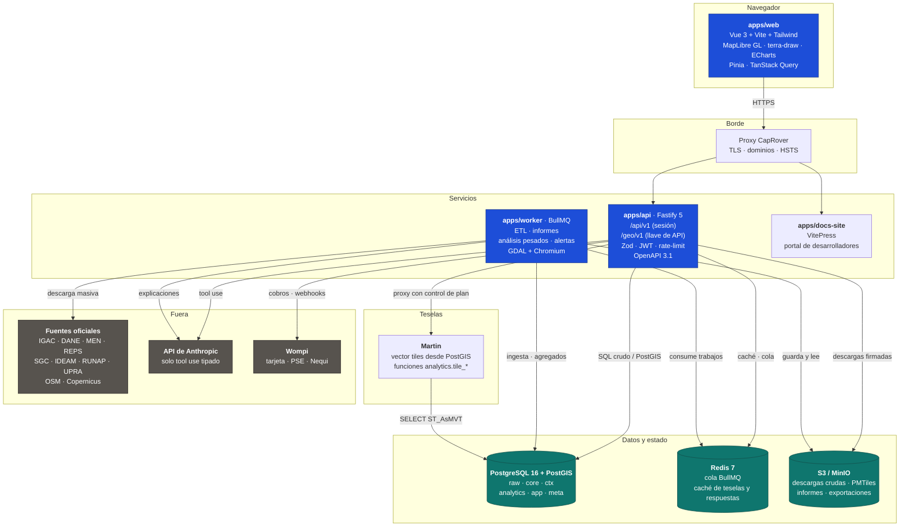
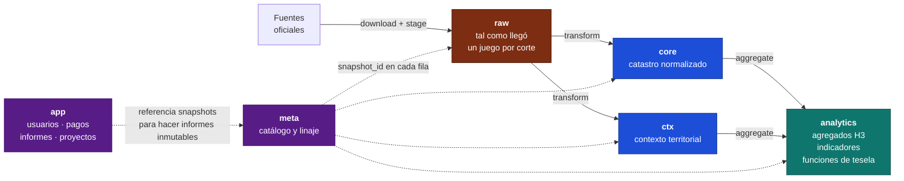
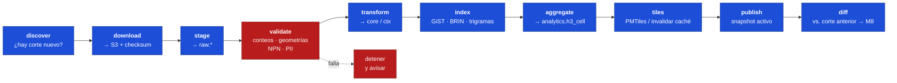
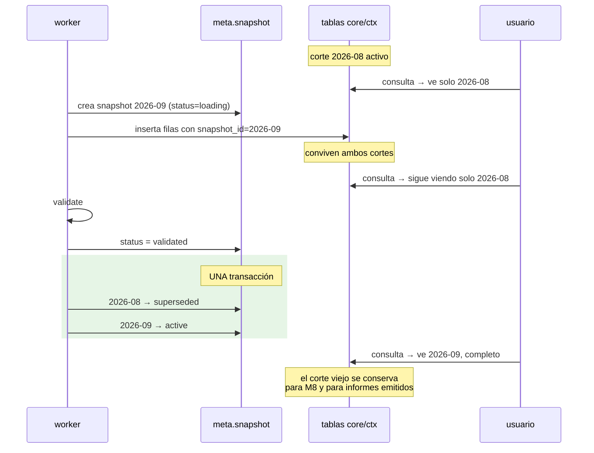
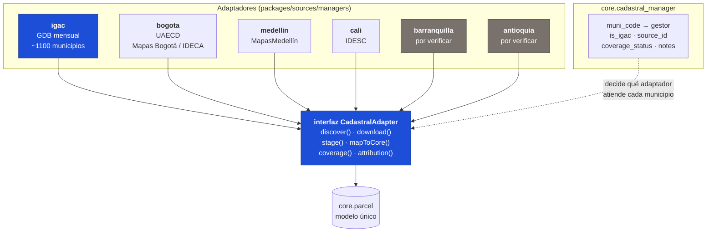
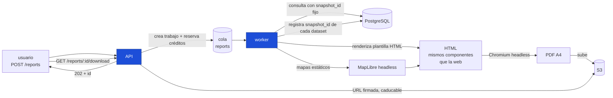
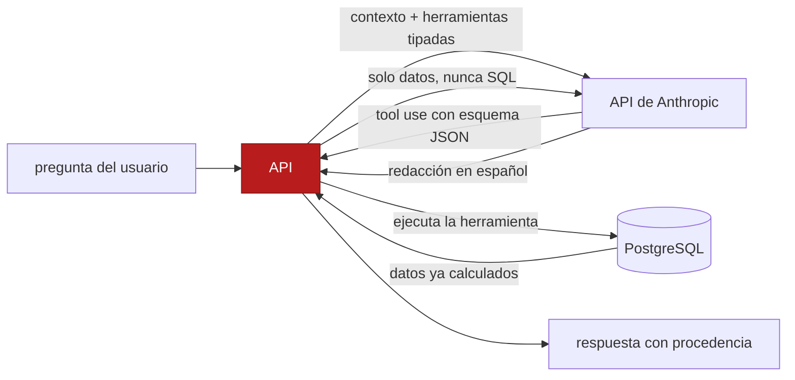
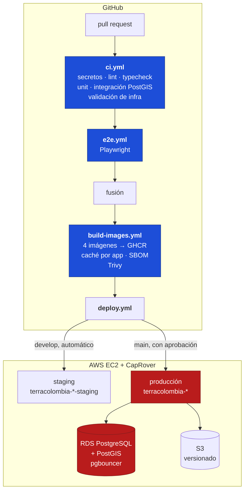

# Arquitectura de TerraColombia

> Cómo está construido el sistema y **por qué** está construido así. Cuando una
> decisión no era obvia, aquí está el motivo; cuando además hubo alternativas
> descartadas, están en [`DECISIONES.md`](./DECISIONES.md).

Documento vivo. Si el código dice una cosa y este documento dice otra, el código
tiene razón y este documento tiene un error que hay que corregir.

---

## Tabla de contenido

1. [La idea en una página](#la-idea-en-una-pagina)
2. [Componentes](#componentes)
3. [Modelo de datos por esquema](#modelo-de-datos-por-esquema)
4. [El ETL, paso por paso](#el-etl-paso-por-paso)
5. [Publicación atómica por `snapshot_id`](#publicacion-atomica)
6. [Particionado de `core.parcel`](#particionado)
7. [Teselas vectoriales](#teselas)
8. [Agregados H3](#agregados-h3)
9. [Motor de puntuación y explicabilidad](#puntuacion)
10. [Adaptadores por gestor catastral (Fase 7)](#adaptadores)
11. [Informes](#informes)
12. [El asistente de IA](#asistente-ia)
13. [Despliegue](#despliegue)
14. [Decisiones que sostienen todo lo anterior](#decisiones-clave)

---

<a id="la-idea-en-una-pagina"></a>

## 1. La idea en una página

TerraColombia responde una pregunta: **«¿qué hay en este pedazo de Colombia y qué
significa?»** El usuario señala un punto, un predio, una dirección o dibuja una
zona, y obtiene en segundos una respuesta en lenguaje claro, con fuentes citadas
y exportable.

Tres restricciones de diseño mandan sobre todo lo demás:

**1. Los datos son del Estado, no nuestros.** La base catastral del IGAC es
CC BY-SA 4.0 y su cláusula *ShareAlike* puede alcanzar a bases derivadas que se
redistribuyan. El negocio no puede montarse sobre exclusividad del dato, sino
sobre **servicio**: normalización, cruce, análisis, experiencia de uso y SLA. De
ahí que en la base de datos y en las exportaciones los datos del IGAC (capa
abierta) estén **separados** de los indicadores propios: es una frontera
arquitectónica, no una convención de nombres.

**2. Las fuentes no se pueden consultar en vivo.** Los servicios ArcGIS REST del
IGAC paginan de 2000 en 2000, no permiten estadísticas ni consultas avanzadas y
no garantizan disponibilidad. Cualquier producto que dependa de ellos en la ruta
de petición del usuario es un producto que se cae cuando se cae el IGAC. Por eso
**todo se ingiere a un PostGIS propio** por descargas masivas; REST se usa solo
para descubrir, completar capas pequeñas y validar.

**3. Cero datos personales, sin excepciones.** No existe ni existirá la ruta
predio → persona. Esto no es una política que se aplica al final: determina qué
columnas se ingieren, qué columnas se publican en las teselas, qué se registra en
los logs y qué preguntas puede responder el asistente. La lista negra de
`etl/config/pii-blocklist.ts` se aplica en la ingesta, antes de que el dato toque
`core` o `ctx`.

---

<a id="componentes"></a>

## 2. Componentes



### Qué hace cada pieza y por qué está separada

| Componente | Responsabilidad | Por qué es un proceso aparte |
|---|---|---|
| **web** | Toda la interfaz. Mapa, fichas, asistentes, tableros. | Estático servido por nginx: escala a coste cero y no comparte destino con el backend. |
| **api** | Único borde de entrada. Autenticación, autorización por plan, validación, consulta, proxy de teselas, creación de trabajos. | Es lo que más escala horizontalmente y lo que tiene que arrancar en segundos. Nada pesado vive aquí. |
| **worker** | Todo lo que tarda más de un segundo: ETL, informes PDF, análisis de áreas grandes, alertas programadas. | Un ETL de 1 GB no puede competir por CPU con la petición de un usuario. Además necesita GDAL y Chromium, que la API no. |
| **docs-site** | Documentación de la GeoAPI, *playground*, ejemplos. | Se despliega y versiona con la API pero no comparte su disponibilidad. |
| **PostgreSQL + PostGIS** | La verdad. Todo dato, toda geometría, todo linaje. | — |
| **Redis** | Cola de trabajos (BullMQ) y caché. | Con degradación: si no está, la cola corre en memoria (solo desarrollo). |
| **S3 / MinIO** | Archivos: descargas crudas con checksum, PMTiles, informes entregados, exportaciones. | Los informes son inmutables y verificables; el versionado del bucket es parte de esa promesa. |
| **Martin** | Genera teselas vectoriales desde PostGIS. | Opcional: la API sabe generar MVT con `ST_AsMVT`. Ver [ADR-003](./DECISIONES.md). |

### Lo que la API no hace nunca

- **No genera informes.** Crea el trabajo y entrega el archivo. El PDF lo hace el
  worker, que es quien tiene Chromium.
- **No expone Martin.** Martin escucha solo en la red interna. Todo acceso a
  teselas pasa por la API, que aplica cuota por plan, marca de agua y registro de
  uso. Sin eso, las teselas serían un canal de raspado sin control.
- **No consulta fuentes externas en la ruta del usuario.** Ni al IGAC ni a nadie.
  Si el dato no está en PostGIS, la respuesta es «no disponible».

---

<a id="modelo-de-datos-por-esquema"></a>

## 3. Modelo de datos por esquema

Seis esquemas. La separación no es estética: cada uno tiene un ciclo de vida, un
nivel de confianza y unos permisos distintos.



### `raw` — tal como llegó

Cada dataset se carga aquí **sin transformar**, con los nombres de campo
originales de la fuente y un `snapshot_id`.

**Por qué existe.** Sin `raw` no se puede depurar un problema de datos. Cuando
alguien reporta que un área no cuadra, la pregunta es «¿lo trajo mal el IGAC o lo
transformamos mal nosotros?», y solo se puede responder si está guardado lo que
llegó. También permite reprocesar sin volver a descargar 1 GB cuando se corrige
un mapeo.

**Ciclo de vida.** Se conservan los **tres últimos cortes** en línea; los
anteriores viven en S3 (que sí guarda todos, con checksum). Es el esquema que
más pesa y el único que se excluye por defecto de los respaldos: se puede volver
a descargar.

**Confianza: ninguna.** Nada de `raw` se sirve a un usuario, nunca. Puede
contener columnas con PII que la lista negra marcó para descarte, geometrías
inválidas y codificaciones raras. El rol de la API **no tiene permiso de lectura
sobre `raw`**, y Martin tampoco (de ahí `auto_publish: false` en `martin.yaml`).

### `core` — el catastro normalizado

El modelo canónico de predios, construcciones, manzanas, sectores, barrios,
veredas, perímetros, nomenclatura y zonas homogéneas. Nombres en inglés, tipos
coherentes, geometrías válidas en EPSG:4326, NPN descompuesto en sus
componentes.

**Por qué está separado de `ctx`.** Porque `core` es **IGAC y derivados
directos**, y `ctx` es todo lo demás. Esa frontera es la que permite cumplir la
licencia CC BY-SA sin ambigüedad: una exportación de `core` lleva la atribución
del IGAC; una de `ctx` lleva la de cada fuente. Si estuvieran mezclados habría
que rastrear la procedencia columna por columna en cada exportación.

Tabla central:

```
core.parcel(
  id, npn CHAR(30), npn_old VARCHAR(20), muni_code, zone,
  sector, comuna, barrio, manzana_vereda, terreno,
  condicion, edificio, piso, unidad,          -- derivados del NPN
  area_geom_m2, area_reported_m2, built_area_m2,
  economic_use, address, cadastral_value, valuation_year,
  attrs JSONB,                                -- resto de R1/R2 tal cual
  geom geometry(MultiPolygon,4326), centroid, h3_r9,
  snapshot_id, valid_from, valid_to)
```

Dos decisiones que se repiten en todo `core`:

- **`attrs JSONB` para lo que no se modeló.** Los Registros 1 y 2 del IGAC traen
  decenas de campos cuyo uso todavía no está claro. Modelarlos todos en columnas
  sería inventar semántica; descartarlos sería perder información. Van a `attrs`
  tal cual, filtrados por la lista negra de PII, y se promueven a columna propia
  cuando un módulo los necesita de verdad.
- **`valid_from` / `valid_to` además de `snapshot_id`.** El `snapshot_id` dice de
  qué carga viene una fila; las fechas de validez dicen en qué periodo ese predio
  existió con esos atributos. Es lo que hace posible M8 (cambio territorial) y lo
  que permite que un informe emitido en marzo siga siendo verificable en octubre.

El NPN de 30 dígitos se descompone así, y `packages/geo/npn.ts` es el único sitio
donde vive esa lógica:

```
08      573        01     02      00      03     0015          0004     0        00       00     0000
depto   municipio  zona   sector  comuna  barrio manzana/vereda terreno condición edificio piso   unidad
(2)     (3)        (2)    (2)     (2)     (2)    (4)           (4)      (1)      (2)      (2)    (4)
```

### `ctx` — contexto territorial

Todo lo que no es catastro: población (DANE), colegios (MEN), salud (REPS),
suelos y vocación (Agrología IGAC), amenazas (SGC, IDEAM), áreas protegidas
(RUNAP), territorios étnicos (ANT), frontera agrícola (UPRA), POT municipal,
vías y POI (OSM), relieve (Copernicus), contratación pública (SECOP).

**Por qué un esquema propio.** Tres razones prácticas:

1. **Frecuencias distintas.** El catastro es mensual; el MGN del DANE cambia cada
   varios años; OSM es continuo. Mezclarlos obligaría a que cada consulta
   supiera qué tan viejo es cada dato.
2. **Licencias distintas.** Cada fuente tiene la suya (CC BY-SA, ODbL de OSM,
   términos propios de cada entidad). Cada tabla lleva su `dataset_id` y de ahí
   sale la atribución.
3. **Cobertura desigual por diseño.** El POT existe en unos municipios y no en
   otros, y eso es una propiedad del dato, no un fallo. `ctx` es el esquema donde
   «no disponible» es una respuesta legítima y frecuente.

### `analytics` — agregados y funciones de servicio

Tres tipos de cosa viven aquí:

- **`analytics.h3_cell`** — la rejilla hexagonal con todos los indicadores
  precalculados por celda. Es lo que hace posible que el mapa de calor de M6 se
  recalcule mientras el usuario mueve un *slider*.
- **`analytics.muni_indicator`** — series de indicadores por municipio y periodo,
  para el observatorio (M9).
- **`analytics.tile_*`** — las funciones de tesela que consume Martin. Están aquí
  y no en `core` porque son **superficie de servicio**, no modelo de datos: son
  el equivalente SQL de un controlador HTTP, y agruparlas permite dar a Martin un
  rol que solo puede ejecutar estas funciones y no leer ninguna tabla.

**Por qué precalcular.** El objetivo de §13 del plan es que un análisis de 5 km²
responda en menos de 5 segundos. Contar población, colegios, POI y calcular
pendientes dentro de un polígono arbitrario en tiempo real no cabe en 5 segundos
a escala nacional. Con la rejilla H3 precalculada, el análisis es una suma sobre
celdas.

### `app` — la aplicación

Usuarios, organizaciones, membresías, llaves de API, planes, suscripciones, libro
de créditos, pagos, proyectos, áreas y búsquedas guardadas, informes, alertas,
eventos de uso, bitácora de auditoría.

**Es el único esquema que gestiona Prisma** (regla 8 de `CLAUDE.md`). El resto se
migra con SQL versionado y se consulta con SQL crudo, porque ningún ORM maneja
bien `ST_Intersects`, `ST_AsMVT`, particiones ni índices GiST, y pelearse con el
ORM para geometría siempre acaba en SQL crudo de todas formas, pero peor.

**`app` nunca contiene datos de predios.** Un `report` guarda el
`snapshot_id` de cada dataset que usó y la ruta del PDF en S3, no una copia de
los datos. Eso hace el informe inmutable *y* mantiene la frontera: los datos del
IGAC están en `core`, con su licencia.

### `meta` — catálogo y linaje

```
meta.dataset(id, source, name, license, attribution, url, frequency)
meta.snapshot(id, dataset_id, cut_date, loaded_at, row_count, checksum, status, is_synthetic)
```

**Es el esquema que hace cumplible la regla 4** («toda cifra lleva procedencia»).
Cada fila de `raw`, `core`, `ctx` y `analytics` lleva un `snapshot_id` que apunta
aquí, y de aquí sale el bloque `meta.sources[]` que acompaña a toda respuesta de
la API, a toda ficha y a toda exportación.

También es donde vive el estado de publicación: `status ∈ {loading, validated,
active, superseded, failed}`. Solo un snapshot por dataset puede estar `active`.

### Convenciones que aplican a todos los esquemas

| Convención | Motivo |
|---|---|
| Geometrías almacenadas en **EPSG:4326** | Es lo que consumen MapLibre y las teselas; convertir en cada petición sería un coste por lectura. |
| Áreas y distancias calculadas en **EPSG:9377** (MAGNA-SIRGAS / Origen-Nacional) | Es el CRS oficial de Colombia para medición. Calcular áreas en 4326 (grados) da resultados sin sentido; calcular con geografía esférica introduce error frente a la cifra oficial. |
| `ST_MakeValid` en toda ingesta | Las fuentes traen autointersecciones y anillos mal orientados. Una geometría inválida hace fallar el `ST_Intersects` de una consulta cualquiera, a veces meses después. |
| Índice GiST en toda columna geométrica | Sin él, cualquier consulta espacial es un escaneo secuencial. |
| `ST_Subdivide` en polígonos grandes (límites, suelos, áreas protegidas) | Un polígono de un millón de vértices hace que el índice GiST sea inútil: su *bounding box* cubre medio país. Trocearlo en piezas de ~256 vértices multiplica por diez la velocidad de las consultas espaciales. |
| `unaccent` + `pg_trgm` en toda columna de texto buscable | «Bogotá» tiene que encontrarse escribiendo «bogota», y «Cra 7 # 45-12» escribiendo «carrera 7 45 12». |

---

<a id="el-etl-paso-por-paso"></a>

## 4. El ETL, paso por paso

Un solo pipeline, declarado por dataset en `etl/config/datasets/*.ts`, ejecutado
por BullMQ, **idempotente y reanudable**.



**Idempotente** significa que ejecutar dos veces el mismo paso sobre el mismo
corte da el mismo resultado. **Reanudable** significa que si el proceso muere en
`aggregate`, al reiniciar no vuelve a descargar 1 GB. Ambas cosas importan mucho
cuando el paso más largo tarda horas.

### 1. `discover`

Pregunta a la fuente si hay algo nuevo. Para el IGAC, mira el portal de datos
abiertos; para Socrata (MEN, REPS, SECOP), usa la marca de tiempo de última
modificación; para OSM, el índice de Geofabrik.

Respeta al servidor: concurrencia 2, retroceso exponencial, caché en disco y un
`User-Agent` identificable con contacto. No somos un rastreador anónimo
golpeando infraestructura pública.

### 2. `download`

Descarga a S3 bajo `raw/<datasetId>/<cutDate>/`, calcula el checksum y lo guarda
en `meta.snapshot`. **Si el checksum coincide con el del corte anterior, se
detiene aquí**: la fuente republicó lo mismo, no hay nada que procesar. Esto
ahorra una carga completa varias veces al año.

### 3. `stage`

Carga a `raw.*` sin transformar. Dos caminos, y el pipeline informa cuál usó:

- **GDAL (`ogr2ogr`)** para formatos binarios: File Geodatabase, GeoPackage,
  Shapefile. Es el único camino confiable para ellos.
  ```
  ogr2ogr -f PostgreSQL PG:"..." entrada.gdb \
    -nlt PROMOTE_TO_MULTI -lco GEOMETRY_NAME=geom \
    -t_srs EPSG:4326 -makevalid -lco SCHEMA=raw
  ```
- **Lectores nativos en Node** para GeoJSON (incluido *streaming* de ArcGIS REST
  paginado), CSV y Socrata, que escriben con `ST_GeomFromGeoJSON`.

Si falta GDAL y el formato lo exige, el ETL **falla con un mensaje que dice cómo
instalarlo**, en vez de degradar en silencio ([ADR-005](./DECISIONES.md)).

La lista negra de PII se aplica **aquí**, en la carga, no después: las columnas
prohibidas no llegan ni a `raw`. Cada descarte se registra y cuenta en
`tc_pii_detected_total`.

### 4. `validate`

La puerta. Si algo falla, el snapshot **no se publica** y queda en `status =
'failed'` para revisión manual.

| Validación | Umbral | Por qué |
|---|---|---|
| Conteo vs. corte anterior | alerta si varía más de ±10 % | Detecta descargas truncadas, que son el fallo más común y el más silencioso. |
| Geometrías inválidas | se cuentan; se arreglan con `ST_MakeValid`; las irreparables se marcan huérfanas | Una geometría inválida rompe consultas que no tienen nada que ver con ella. |
| NPN mal formados | se cuentan y se listan | El NPN es la llave del producto: sin él, ese predio no es consultable. |
| Duplicados por NPN | error | Dos filas para el mismo predio significan una ficha ambigua. |
| Áreas cero o negativas | se marcan | Suelen indicar geometría corrupta. |
| Huérfanos cruzados | se reportan en ambas direcciones | Geometría sin registro alfanumérico y registro sin geometría: ambos casos existen en la base del IGAC y hay que saber cuántos. |
| PII detectada | **cualquier ocurrencia es una alerta crítica** | La fuente cambió y trae campos nuevos. Hay que inspeccionarla antes de la siguiente carga. |

### 5. `transform`

SQL de `raw` a `core`/`ctx`: renombrado a la convención canónica, tipado,
descomposición del NPN, unión de geometría con Registros 1 y 2 por código
predial, reproyección, cálculo de `area_geom_m2` en EPSG:9377, cálculo del índice
H3 en Node con `h3-js` ([ADR-002](./DECISIONES.md)).

Escribe en **tablas sombra**, no en las de producción. Ver
[publicación atómica](#publicacion-atomica).

### 6. `index`

Crea los índices **después** de cargar, no antes: cargar millones de filas con
los índices ya creados es varias veces más lento. GiST en geometrías, B-tree en
NPN y códigos, trigramas en texto buscable, BRIN en columnas correlacionadas con
el orden físico.

### 7. `aggregate`

Recalcula `analytics.h3_cell` para las celdas afectadas —no para todo el país— y
refresca las vistas materializadas de indicadores municipales.

### 8. `tiles`

Invalida la caché de teselas de las celdas y capas afectadas. Para el mapa base
propio y las capas estáticas, genera PMTiles con `tippecanoe` y los sube a S3.

### 9. `publish`

El cambio de `snapshot_id` activo. Una transacción. Ver la sección siguiente.

### 10. `diff`

Compara con el corte anterior y alimenta `core.parcel_change`, que es la materia
prima de M8:

- **Por NPN**: altas, bajas, cambios de atributos.
- **Por geometría**: `ST_Equals` exacto y, si no, IoU (intersección sobre unión);
  por debajo de 0,98 se marca cambio geométrico. El umbral evita que el ruido de
  redondeo de coordenadas se reporte como un cambio real.
- **Construcciones nuevas**: comparación de `core.building` entre cortes.

Los englobes y desenglobes se detectan por la combinación de ambos: un NPN que
desaparece y varios que aparecen ocupando su misma geometría.

---

<a id="publicacion-atomica"></a>

## 5. Publicación atómica por `snapshot_id`

**El problema.** Cargar el catastro de un departamento tarda horas. Durante ese
tiempo, las tablas contienen una mezcla del corte viejo y del nuevo. Si un
usuario consulta en ese momento, ve una base incoherente: predios que ya no
existen junto a otros que aún no tienen construcciones asociadas.

**La solución.** Ninguna consulta de usuario lee filas sin filtrar por el
snapshot activo, y el cambio de snapshot activo es una transacción.



Tres consecuencias de diseño:

1. **Toda consulta filtra por snapshot activo.** No es opcional ni «casi
   siempre»: si una consulta olvida el filtro, puede devolver datos a medio
   cargar. Por eso las teselas se sirven con funciones `analytics.tile_*` y no
   con fuentes de tipo tabla en Martin: una fuente de tabla haría
   `SELECT … FROM core.parcel` sin filtro.
2. **Reversión instantánea.** Si un corte resulta estar mal después de
   publicarse, volver al anterior es un `UPDATE` de dos filas en
   `meta.snapshot`. No hay que restaurar nada.
3. **Informes inmutables.** Un informe guarda el `snapshot_id` de cada dataset
   que usó. Meses después se puede regenerar idéntico, y el QR de verificación
   lleva a esa misma combinación de cortes. Es lo que hace que un informe sea un
   documento y no una captura de pantalla.

**Los datos de demostración nunca pueden publicarse como reales.** Un snapshot
con `is_synthetic = true` no puede quedar activo si existe uno real para el mismo
dataset, la API marca toda respuesta que lo toque con `meta.synthetic = true` y
la interfaz muestra una banda de advertencia ([ADR-006](./DECISIONES.md)).

---

<a id="particionado"></a>

## 6. Particionado de `core.parcel`

`core.parcel` a escala nacional son decenas de millones de filas con geometría.
Está particionada **por lista, por código de departamento**:

```sql
CREATE TABLE core.parcel (...) PARTITION BY LIST (dept_code);

CREATE TABLE core.parcel_08 PARTITION OF core.parcel FOR VALUES IN ('08'); -- Atlántico
CREATE TABLE core.parcel_15 PARTITION OF core.parcel FOR VALUES IN ('15'); -- Boyacá
CREATE TABLE core.parcel_73 PARTITION OF core.parcel FOR VALUES IN ('73'); -- Tolima
-- … una por departamento
```

**Por qué por departamento y no por fecha de corte ni por hash.** Porque es como
llegan los datos y como se consultan:

- **La descarga del IGAC es por departamento.** Cargar un departamento nuevo es
  crear una partición y llenarla, sin tocar las demás. Y `DROP TABLE` de una
  partición es instantáneo, mientras que `DELETE FROM … WHERE dept_code = '08'`
  sobre una tabla de 40 millones de filas tarda y deja bloat.
- **Casi toda consulta acota por municipio o por *bbox*.** El planificador
  descarta las 31 particiones que no aplican antes de mirar un solo índice
  (*partition pruning*). Un `bbox` de un barrio de Barranquilla no toca nada de
  Amazonas.
- **Mantenimiento por partes.** `VACUUM`, `ANALYZE`, `CLUSTER` y `REINDEX` se
  hacen departamento a departamento, en la ventana de carga de ese departamento,
  sin bloquear el país.
- **El escalado nacional es incremental.** La Fase 7 añade departamentos uno a
  uno, y cada uno es una partición que entra sin afectar a las que ya funcionan.

Dentro de cada partición: GiST en `geom` y `centroid`, B-tree en `npn` y
`muni_code`, B-tree en `h3_r9`, y `CLUSTER` por índice geográfico tras cada carga
para que los predios vecinos estén físicamente juntos (las consultas por *bbox*
leen muchas menos páginas de disco).

`max_locks_per_transaction` está subido a 512 en la configuración de Postgres: una
consulta que toque todas las particiones y sus índices necesita más cerraduras de
las que da el valor por defecto.

---

<a id="teselas"></a>

## 7. Teselas vectoriales

### Por zoom

| Zoom | Qué se dibuja | Fuente |
|---|---|---|
| 0–5 | Departamentos, rejilla H3 r5 | `tile_department`, `tile_h3_cell` |
| 6–9 | Municipios, rejilla H3 r6–r7 | `tile_municipality`, `tile_h3_cell` |
| 10–13 | Sectores, manzanas, rejilla H3 r8 | `tile_sector`, `tile_block`, `tile_h3_cell` |
| **≥ 14** | **Predios y construcciones** | `tile_parcel`, `tile_building` |

El corte en 14 no es arbitrario: por debajo, una tesela de zona urbana densa
contiene decenas de miles de polígonos de predio. Generarla es lento, pesa MB y
el resultado es una mancha negra. Lo que el usuario necesita a zoom bajo no son
predios individuales, es densidad — y eso es lo que da la rejilla H3.

### Por qué funciones de tesela y no fuentes de tabla

Martin puede publicar tablas directamente. No se usa, por cuatro razones:

1. **Filtrado por snapshot activo.** Una fuente de tabla no puede hacerlo, y
   serviría filas de una carga en curso.
2. **Control de columnas.** La función publica una lista explícita. Una fuente de
   tabla publica lo que haya, incluidas columnas que añada una migración futura.
   En teselas eso importa especialmente: son el canal más fácil de raspar a
   escala, así que ni `attrs`, ni `address`, ni `cadastral_value` salen por ahí.
3. **Parámetros.** `?snapshot=` para comparar cortes (M8), `?res=` para forzar
   resolución H3, `?kind=` para filtrar amenazas, `?indicator=` para elegir qué
   pinta el mapa de calor.
4. **Permisos.** El rol de Martin solo tiene `EXECUTE` sobre `analytics.tile_*` y
   ningún `SELECT` sobre las tablas base. Las funciones son `SECURITY DEFINER`.
   Si Martin se compromete, lo único que puede hacer es pedir teselas.

Las fuentes están declaradas en [`infra/martin.yaml`](../infra/martin.yaml), con
la lista de columnas publicadas documentada capa por capa.

### La ruta de una tesela

```
navegador → GET /api/v1/tiles/parcel/16/19523/29184.mvt
              ↓  la API verifica: plan, cuota diaria, área permitida
              ↓  ¿está en Redis?  → sí: devuelve (objetivo: < 200 ms p95)
              ↓                     no: ↓
              ↓  ¿MARTIN_URL definido?
              ↓     sí → proxy a Martin → analytics.tile_parcel(z,x,y,query)
              ↓     no → la propia API hace ST_AsMVT
              ↓  guarda en Redis con TTL ligado al snapshot activo
              ↓  añade marca de agua si el plan es gratis
           respuesta
```

La API es siempre la puerta. Cambiar entre Martin y `ST_AsMVT` no cambia nada
para el frontend: es la misma URL ([ADR-003](./DECISIONES.md)).

La clave de caché incluye el `snapshot_id` activo. Así, publicar un corte nuevo
invalida la caché sin recorrerla: las claves viejas simplemente dejan de
consultarse y caducan solas.

---

<a id="agregados-h3"></a>

## 8. Agregados H3

[H3](https://h3geo.org/) es una rejilla hexagonal jerárquica global. Se usa como
unidad de agregación para todo lo que no es un predio concreto.

**Por qué hexágonos y no una rejilla cuadrada ni las manzanas censales.**

- Todos los vecinos de un hexágono están a la misma distancia del centro. En una
  rejilla cuadrada, los vecinos diagonales están un 41 % más lejos que los
  ortogonales, lo que sesga cualquier cálculo de vecindad o de difusión.
- Las celdas tienen área casi constante dentro de una resolución, así que las
  densidades son comparables entre celdas sin normalizar.
- Es jerárquica: cada celda de resolución *r* se descompone en ~7 de *r+1*, lo
  que permite cambiar el nivel de detalle por zoom sin recalcular desde cero.
- Las manzanas censales son la unidad del DANE, no una unidad de análisis:
  tienen tamaños dispares, no existen en zona rural y cambian entre censos. Se
  usan como **fuente** de población, no como unidad de agregación.

| Resolución | Arista aprox. | Uso |
|---|---|---|
| r5 | ~8,5 km | Vista nacional |
| r6 | ~3,2 km | Vista departamental |
| r7 | ~1,2 km | Vista municipal |
| **r8** | **~460 m** | **Localización de negocio (M6)** |
| **r9** | **~175 m** | **Análisis fino, índice de cada predio** |

`analytics.h3_cell` guarda, por celda: número de predios y estadísticas de área,
población total y en edad escolar, colegios y equipamientos de salud, conteos de
POI por categoría, puntaje de acceso viario, pendiente media y banderas de
amenaza.

Cada predio lleva su `h3_r9` precalculado, lo que convierte «qué hay alrededor de
este predio» en una consulta sobre la celda y sus vecinas, en vez de en una
consulta espacial sobre varias tablas grandes.

Los índices H3 se calculan **en Node con `h3-js`** y se guardan como `TEXT` de 15
caracteres con índice B-tree, porque no hay binario precompilado de la extensión
`h3` para PostgreSQL 17 en Windows. Los valores son idénticos carácter a carácter
a `h3index::text`, así que si en el futuro se despliega sobre Linux con la
extensión disponible, la conversión es directa ([ADR-002](./DECISIONES.md)).

---

<a id="puntuacion"></a>

## 9. Motor de puntuación y explicabilidad

`packages/scoring` calcula indicadores normalizados 0–100 por celda H3. Cada
indicador declara su **fórmula, su fuente y su dirección** (más es mejor / más es
peor). Las plantillas de negocio (colegio, retail, salud, bodega, vivienda)
combinan indicadores con pesos que el usuario puede mover en vivo.

**La respuesta nunca es solo un puntaje.** Siempre incluye el desglose por
factor: cuánto aportó cada indicador, con qué peso, de qué fuente y con qué fecha
de corte. Sin eso, un número entre 0 y 100 es una opinión disfrazada de dato.

Y el sistema **no recomienda**. No dice «elija la zona A». Muestra los
indicadores, deja que el usuario fije sus criterios y explica el resultado. La
diferencia importa: un avaluador o un banco necesitan poder defender la
conclusión ante un tercero, y para eso necesitan los factores, no el veredicto.

---

<a id="adaptadores"></a>

## 10. Adaptadores por gestor catastral (Fase 7)

**El problema.** El IGAC no es el catastro de toda Colombia. Bogotá, Medellín,
Cali, Barranquilla, el departamento de Antioquia y un número creciente de
gestores catastrales habilitados tienen su propio catastro, su propio modelo de
datos y su propia política de publicación. La base abierta del IGAC cubre solo
los municipios donde el IGAC es gestor.

**La solución arquitectónica**, no comercial: una interfaz común y un adaptador
por gestor.



Cada adaptador implementa la misma interfaz:

| Método | Qué resuelve |
|---|---|
| `discover()` | ¿Hay corte nuevo? Cada gestor lo publica a su ritmo y de su manera. |
| `download()` | Descarga con checksum. Formatos distintos por gestor. |
| `stage()` | A `raw.<gestor>_*`, con los nombres de campo originales de ese gestor. |
| `mapToCore()` | La parte difícil: traducir el modelo del gestor a `core.parcel`. |
| `coverage()` | Qué municipios cubre, con qué corte y qué campos tiene y no tiene. |
| `attribution()` | El texto de atribución y la licencia de ese gestor, que **no** es la del IGAC. |

Tres cosas que esta arquitectura hace posibles:

**1. Cobertura honesta, automática.** `core.cadastral_manager` es la fuente de
verdad de quién gestiona cada municipio y en qué estado está. La interfaz la
consulta para decir, en vez de mostrar un mapa vacío: «Este municipio lo gestiona
la UAECD (Bogotá); aún no tenemos sus predios. Sí tenemos: población, colegios,
equipamientos de salud, suelos y amenazas.» Esa frase es la regla 6 de
`CLAUDE.md` hecha código.

**2. Campos ausentes declarados, no inventados.** Si un gestor no publica avalúo
catastral, el campo queda `NULL` y la cobertura lo declara `NO_DISPONIBLE`. No se
estima, no se interpola, no se rellena con el promedio del sector. Un hueco
declarado es información; un hueco rellenado es una mentira con formato de dato.

**3. Atribución por gestor.** La atribución del IGAC no vale para un predio de
Bogotá. Cada predio arrastra su `dataset_id` y de ahí sale la atribución
correcta en la ficha, el informe y la exportación.

---

<a id="informes"></a>

## 11. Informes



Las plantillas HTML usan **los mismos componentes visuales que la web**. Es lo
que evita que el PDF y la pantalla digan cosas distintas, que es el defecto
clásico de los generadores de informes con plantilla aparte.

Todo informe incluye, sin excepción: fuentes con fecha de corte y licencia, la
atribución del IGAC cuando usa datos catastrales, la advertencia de que el avalúo
catastral no es valor comercial, y los textos legales obligatorios (no es
certificado catastral, no es avalúo, no es concepto urbanístico, no reemplaza
estudio de títulos). Un QR lleva a la página de verificación, que muestra
exactamente qué cortes se usaron.

Formatos: PDF, XLSX (una hoja por sección más una hoja `FUENTES_Y_LICENCIA`),
CSV, GeoJSON, GeoPackage, Shapefile y KML. **Toda** exportación lleva su archivo
u hoja de fuentes y licencia; no hay forma de exportar datos sin su procedencia.

---

<a id="asistente-ia"></a>

## 12. El asistente de IA

El asistente traduce preguntas en lenguaje natural a llamadas de herramienta, y
explica indicadores. Nada más.



Cuatro guardas, y ninguna es opcional:

1. **Solo herramientas tipadas.** `search_places`, `query_parcels`,
   `analyze_area`, `explain_indicator`. El modelo elige qué herramienta llamar y
   con qué argumentos; los argumentos se validan con Zod. **Nunca** genera SQL, y
   no hay ninguna ruta de código por la que un texto del modelo llegue a la base
   de datos.
2. **Los datos llegan ya calculados.** El modelo redacta a partir de números que
   produjo el sistema. No hace aritmética sobre ellos.
3. **Si la herramienta no devuelve el dato, la respuesta es «no disponible».** No
   se completa con conocimiento general del modelo. Un número plausible inventado
   es peor que un hueco declarado.
4. **Registro sin PII.** Los *prompts* se guardan para mejorar el sistema, sin
   datos personales y sin identificadores de usuario ligados al contenido.

El modelo se configura por variable de entorno (`ANTHROPIC_MODEL`). Si no hay
llave configurada, el asistente responde «no disponible» y el resto del producto
funciona igual: la IA es una capa de comodidad sobre datos que ya existen, no un
componente del que dependa nada.

---

<a id="despliegue"></a>

## 13. Despliegue



Cuatro aplicaciones CapRover: `api`, `web`, `worker`, `docs`. Los `Dockerfile`
están en [`infra/caprover/`](../infra/caprover/), con la justificación de cada
decisión de imagen en su [README](../infra/caprover/README.md).

La aprobación de producción se impone con un **environment protegido de GitHub**,
no con un `if` en el workflow: un `if` lo puede saltar cualquiera con permiso de
escritura; un environment con revisores obligatorios detiene el job antes de
ejecutar un paso.

El orden de despliegue es deliberado: **worker → api → web**. Así la cola está
lista antes de que la API cree trabajos, y la API tiene los endpoints nuevos
antes de que llegue el frontend que los pide.

El detalle operativo está en [`OPERACION.md`](./OPERACION.md).

---

<a id="decisiones-clave"></a>

## 14. Decisiones que sostienen todo lo anterior

| # | Decisión | Por qué |
|---|---|---|
| [ADR-001](./DECISIONES.md) | Postgres nativo del equipo como base de desarrollo | Docker no corre en el equipo; el contenedor queda para CI y producción. |
| [ADR-002](./DECISIONES.md) | H3 como `TEXT`, calculado con `h3-js` | No hay extensión `h3` para PostgreSQL 17 en Windows. Sin pérdida de funcionalidad. |
| [ADR-003](./DECISIONES.md) | Teselas por la API con `ST_AsMVT`, Martin opcional | Un solo despliegue en desarrollo; misma URL en producción con Martin activo. |
| [ADR-004](./DECISIONES.md) | Cola y almacenamiento con degradación | El mismo código de ETL e informes corre con y sin Redis/S3. |
| [ADR-005](./DECISIONES.md) | Lectores nativos + `ogr2ogr` opcional | REST y CSV funcionan sin GDAL; la GDB del IGAC lo exige y falla explícitamente si falta. |
| [ADR-006](./DECISIONES.md) | Snapshots sintéticos marcados y nunca mezclados | Tests y demos reproducibles sin presentar nada inventado como real. |
| [ADR-007](./DECISIONES.md) | DSL traducido con constructor tipado | No existe ruta de concatenación de cadenas a SQL. |
| §7 de este documento | Funciones de tesela en vez de fuentes de tabla | Filtrado por snapshot, control de columnas, parámetros y permisos mínimos. |
| §6 de este documento | `core.parcel` particionada por departamento | Es como llegan los datos, como se consultan y como se escala. |
| [infra/caprover](../infra/caprover/README.md) | Los informes PDF los genera el worker, no la API | Chromium pesa 450 MB; la API es lo que más escala y los informes ya son asíncronos. |

---

## Documentos relacionados

- [`PLAN_CLAUDE_CODE_TerraColombia.md`](../PLAN_CLAUDE_CODE_TerraColombia.md) — plan maestro
- [`CLAUDE.md`](../CLAUDE.md) — las diez reglas de trabajo
- [`DECISIONES.md`](./DECISIONES.md) — registro de decisiones (ADR)
- [`OPERACION.md`](./OPERACION.md) — puesta en marcha, ETL, respaldos, problemas frecuentes
- [`SEGURIDAD.md`](./SEGURIDAD.md) — OWASP ASVS nivel 2 aplicado a este sistema
- [`ESTADO.md`](./ESTADO.md) — estado por fases
