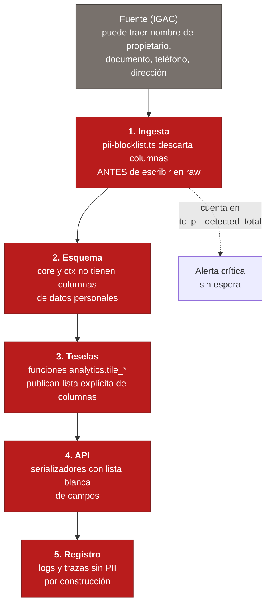

# Seguridad de TerraColombia

> **OWASP ASVS nivel 2** aplicado a este sistema concreto: qué controles hay,
> dónde están en el código y por qué se eligieron así.
>
> No es una lista genérica. TerraColombia tiene tres riesgos que la mayoría de
> las aplicaciones no tiene, y son los que mandan sobre el resto:
>
> 1. **Datos personales que no deben existir.** La fuente (el catastro) los
>    contiene. Nuestro trabajo es que no entren.
> 2. **Datos que valen dinero y son fáciles de raspar.** Las teselas y la API
>    entregan geometría estructurada: sin control, se copia la base completa.
> 3. **Una frontera de licencia que hay que mantener.** Los datos del IGAC son
>    CC BY-SA; los indicadores propios no. Mezclarlos tiene consecuencias
>    legales.

**Reportar un fallo de seguridad:** aviso privado en
[GitHub Security Advisories](https://github.com/terracolombia/terracolombia/security/advisories/new).
No abra una incidencia pública.

**Datos personales expuestos:** **privacidad@terracolombia.co**, de inmediato.

---

## Tabla de contenido

1. [Cero datos personales](#cero-pii)
2. [OWASP ASVS nivel 2: cobertura](#asvs)
3. [Consultas parametrizadas](#sql)
4. [Validación en el borde](#validacion)
5. [Autenticación y sesiones](#auth)
6. [Llaves de API](#llaves-api)
7. [Autorización por plan](#autorizacion)
8. [CORS](#cors)
9. [CSP y cabeceras](#csp)
10. [Límite de peticiones](#limite-de-peticiones)
11. [Anti-scraping](#anti-scraping)
12. [Registro sin PII](#registro-sin-pii)
13. [Secretos](#secretos)
14. [La IA como superficie de ataque](#ia)
15. [Dependencias y cadena de suministro](#dependencias)
16. [Respuesta ante incidentes](#respuesta-ante-incidentes)
17. [Lista de verificación antes del lanzamiento](#checklist)

---

<a id="cero-pii"></a>

## 1. Cero datos personales

La regla 3 de [`CLAUDE.md`](../CLAUDE.md) es la más importante del proyecto:
**no existe ni existirá la ruta predio → persona.**

No es una política que se aplique al final. Determina el diseño en cinco capas, y
cada una es una barrera independiente.



### Barrera 1 — la ingesta

`etl/config/pii-blocklist.ts` contiene los nombres de columna prohibidos (y sus
variantes de escritura, porque las fuentes colombianas no son consistentes). Se
aplica en el paso `stage`, **antes** de escribir en `raw`. Las columnas
prohibidas no llegan ni al esquema crudo.

Cada descarte se registra y cuenta en `tc_pii_detected_total{dataset,column}`. Esa
métrica dispara `TerraColombiaPiiDetectada`, que es **crítica y sin periodo de
espera**: un solo caso basta. No porque el dato haya pasado —no pasó—, sino porque
significa que **la fuente cambió y trae campos nuevos**, y hay que inspeccionarla
antes de la siguiente carga y verificar que ningún corte anterior pasó sin el
filtro.

### Barrera 2 — el esquema

Ninguna tabla de `core`, `ctx`, `analytics` o `meta` tiene columnas de datos
personales. Esto se verifica **por máquina en cada corrida de CI**, no por buena
voluntad: `ci.yml` consulta `information_schema.columns` buscando nombres que
parezcan datos personales (`propietario`, `cedula`, `documento`, `telefono`,
`correo`, `apellido`…) y falla el build si encuentra alguno.

`core.parcel.address` existe y es la dirección **del inmueble** (nomenclatura
catastral), no de una persona. No sale en teselas (barrera 3) y se entrega solo en
la ficha, que pasa por control de plan y registro de uso.

### Barrera 3 — las teselas

Las teselas son el canal más fácil de raspar a gran escala, así que llevan el
control más estricto. Cada función `analytics.tile_*` publica una **lista
explícita de columnas**, documentada capa por capa en
[`infra/martin.yaml`](../infra/martin.yaml). Además:

- `auto_publish: false` en Martin. Sin esto, Martin publicaría toda tabla con
  geometría que encuentre, incluidas las de `raw`.
- El rol de Martin tiene `EXECUTE` sobre las funciones de tesela y **ningún
  `SELECT`** sobre las tablas base. Las funciones son `SECURITY DEFINER`.
- `attrs` (el JSONB con el resto de campos de R1/R2) **nunca** sale en una tesela.
  Es la columna que podría contener un campo no inspeccionado.

### Barrera 4 — la API

Los serializadores usan lista blanca de campos, no exclusión. Un campo nuevo en la
base de datos **no aparece** en la respuesta hasta que alguien lo añade
explícitamente al serializador. La diferencia importa: con lista negra, añadir una
columna la expone por omisión.

### Barrera 5 — el registro

Ver [Registro sin PII](#registro-sin-pii).

### Datos con reserva legal

La Ley 1712/2014 art. 19 excluye del acceso público los predios con reserva legal
(inmuebles de seguridad, entre otros). Si un dataset los marca, se excluyen en la
ingesta igual que la PII. Si no los marca pero se identifican después, se añaden a
una lista de exclusión por NPN en `meta` y se filtran en todas las consultas.

---

<a id="asvs"></a>

## 2. OWASP ASVS nivel 2: cobertura

Nivel 2 es el que corresponde a una aplicación que maneja datos de negocio y
pagos. Resumen por capítulo, con el detalle en las secciones siguientes.

| Cap. | Área | Estado | Dónde |
|---|---|---|---|
| **V1** | Arquitectura y ciclo de vida | Modelo de amenazas en este documento; revisión de seguridad en CI (CodeQL, dependency-review, Trivy) | [`ARQUITECTURA.md`](./ARQUITECTURA.md), `.github/workflows/` |
| **V2** | Autenticación | argon2id, política de contraseñas, OAuth Google, rotación de tokens | [§5](#auth) |
| **V3** | Gestión de sesiones | JWT de acceso corto + refresco rotativo con detección de reutilización | [§5](#auth) |
| **V4** | Control de acceso | Autorización por plan y por organización, comprobada en el servidor | [§7](#autorizacion) |
| **V5** | Validación y codificación | Zod en todo borde; SQL solo parametrizado; escapado automático en Vue | [§3](#sql), [§4](#validacion) |
| **V6** | Criptografía | argon2id para contraseñas, SHA-256 para llaves de API, TLS 1.2+ obligatorio, secretos fuera del repositorio | [§6](#llaves-api), [§13](#secretos) |
| **V7** | Errores y registro | Errores en español sin filtrar detalles internos; registro estructurado sin PII | [§12](#registro-sin-pii) |
| **V8** | Protección de datos | Cero PII por diseño; minimización; exportaciones con procedencia | [§1](#cero-pii) |
| **V9** | Comunicaciones | HTTPS con HSTS; Martin y Redis solo en red interna | [§9](#csp) |
| **V10** | Código malicioso | CodeQL, dependency-review, SBOM y atestación de procedencia de las imágenes | [§15](#dependencias) |
| **V11** | Lógica de negocio | Créditos y cuotas en el servidor; webhooks de pago idempotentes | [§7](#autorizacion), [§10](#limite-de-peticiones) |
| **V12** | Archivos y recursos | Descargas por URL firmada caducable; subidas validadas por tipo y tamaño | [§7](#autorizacion) |
| **V13** | API y servicios web | OpenAPI 3.1 como contrato; validación de esquema; límites por plan | [§4](#validacion) |
| **V14** | Configuración | Imágenes sin root, secretos por entorno, cabeceras de seguridad | [§9](#csp), [§13](#secretos) |

---

<a id="sql"></a>

## 3. Consultas parametrizadas

**Regla absoluta: no existe ninguna ruta de código que concatene texto hacia
SQL.** Ni una.

Esto no es una aspiración: es verificable. Toda consulta pasa por
`packages/db/src/sql.ts`, que expone plantillas etiquetadas que solo pueden
producir una cadena con marcadores `$1, $2, …` más un arreglo de valores.

```ts
// Correcto: el valor viaja como parámetro, jamás como texto.
const filas = await db.query(sql`
  SELECT npn, area_geom_m2
  FROM core.parcel
  WHERE muni_code = ${muniCode}
    AND snapshot_id = ${snapshotActivo}
    AND ST_Intersects(geom, ST_GeomFromGeoJSON(${JSON.stringify(poligono)}))
`);
```

### El caso difícil: nombres de columna dinámicos

El DSL de `POST /parcels/query` deja que el cliente elija por qué columna filtrar
y ordenar. Un nombre de columna **no puede** ser un parámetro `$n`, así que aquí
es donde normalmente aparece la inyección.

La solución es que el nombre nunca venga del cliente: viene de un **mapa blanco**.

```ts
// packages/db/src/sql.ts
const PARCEL_FILTER_COLUMNS = {
  zone:          'p.zone',
  area_m2:       'p.area_geom_m2',
  built_area_m2: 'p.built_area_m2',
  economic_use:  'p.economic_use',
  // …
} as const;

// El cliente manda una CLAVE de este objeto, no un nombre de columna.
// Si la clave no existe, la petición se rechaza con 400 antes de tocar la base.
```

El cliente envía `"area_m2"`; el constructor busca esa clave y usa el valor
asociado. Una clave desconocida es un `400`, no una consulta. Detalle en
[ADR-007](./DECISIONES.md).

### Controles de apoyo

| Control | Motivo |
|---|---|
| `statement_timeout` por petición, según plan | Una consulta patológica no puede monopolizar la base. |
| Usuario de solo lectura (`DATABASE_URL_RO`) para la GeoAPI pública | Aunque hubiera una inyección, no podría escribir. |
| Rol de la API **sin permiso sobre `raw`** | El esquema crudo puede tener columnas descartadas: nadie debe poder leerlo desde la web. |
| Rol de Martin: solo `EXECUTE` sobre `analytics.tile_*` | Mínimo privilegio en el componente más expuesto. |
| CodeQL con `security-and-quality` | Detecta rutas de datos no confiables hacia consultas. |

---

<a id="validacion"></a>

## 4. Validación en el borde

**Todo lo que entra se valida con Zod antes de que ninguna lógica lo toque.**
«Todo lo que entra» incluye cuatro bordes, no uno:

| Borde | Qué se valida |
|---|---|
| Rutas HTTP | Cuerpo, parámetros de ruta, *query string*, cabeceras relevantes |
| Trabajos de cola | La carga de cada trabajo, al consumirlo. Un trabajo puede venir de una versión anterior del código. |
| Entradas de ETL | Cada fila de la fuente, contra el esquema declarado del dataset |
| Webhooks | Firma criptográfica **primero**, esquema después |

Cuatro reglas de validación propias de este dominio:

**1. Geometrías.** Un GeoJSON de usuario puede ser un ataque de denegación de
servicio: un polígono con un millón de vértices, o uno que cubre el planeta.

```ts
// packages/shared/src/dsl.ts
const GeometriaSchema = z.object({ /* … */ })
  .refine((g) => contarVertices(g) <= 10_000,
    'La geometría tiene demasiados vértices (máximo 10.000).')
  .refine((g) => areaKm2(g) <= limiteDelPlan,
    'El área supera el máximo de su plan.')
  .refine((g) => esValida(g), 'La geometría no es válida (autointersección).')
  .refine((g) => intersectaColombia(g),
    'La geometría está fuera de Colombia.');
```

**2. NPN.** Se valida estructuralmente, no solo por longitud: los códigos de
departamento y municipio tienen que existir en DIVIPOLA. Un NPN sintácticamente
correcto pero con departamento `99` es un error del cliente, no una consulta a
ejecutar.

**3. Límites por plan en el servidor, siempre.** `limit`, área máxima, filas de
exportación, resolución H3. Aunque la interfaz ya los imponga: la interfaz es una
sugerencia, el servidor es la autoridad.

**4. Mensajes de error en español, sin filtrar internos.** El usuario ve qué hizo
mal; no ve nombres de tabla, rutas de archivo ni trazas.

```
400  "El área solicitada (12,4 km²) supera el máximo de su plan (5 km²)."
400  "El código predial debe tener 30 o 20 dígitos numéricos."
403  "Su plan no incluye exportación. Planes con exportación: Pro, Business."
429  "Ha superado el límite de peticiones. Reintente en 42 segundos."
```

---

<a id="auth"></a>

## 5. Autenticación y sesiones

### Contraseñas

**argon2id**, no bcrypt: resiste mejor los ataques con hardware especializado.
Parámetros: 19 MiB de memoria, 2 iteraciones, paralelismo 1 (recomendación de
OWASP; se revisan anualmente).

| Control | Valor |
|---|---|
| Longitud mínima | 12 caracteres |
| Longitud máxima | 128 (evita denegación de servicio por hash de entradas enormes) |
| Composición obligatoria | **ninguna**. Las reglas de «una mayúscula y un símbolo» producen `Password1!`. La longitud es lo que importa. |
| Contraseñas filtradas | Se rechazan contra la lista de HaveIBeenPwned (por prefijo de hash: la contraseña no sale del servidor) |
| Cambio de contraseña | Invalida **todos** los tokens de refresco |

### Tokens

| Token | Duración | Dónde vive |
|---|---|---|
| Acceso (JWT) | 15 minutos | Memoria del cliente, **nunca** en `localStorage` |
| Refresco | 30 días, **rotativo** | Cookie `httpOnly`, `Secure`, `SameSite=Strict` |

**Rotación con detección de reutilización.** Cada uso del token de refresco emite
uno nuevo e invalida el anterior. Si llega un token de refresco ya usado, se
asume robo: se invalida **toda la familia de tokens** de esa sesión y se fuerza el
inicio de sesión. Es lo que convierte un token robado en una ventana de minutos en
lugar de treinta días.

`JWT_SECRET` y `JWT_REFRESH_SECRET` **tienen que ser distintos**. Si fueran
iguales, un token de refresco valdría como token de acceso.
`check-health.ps1` lo comprueba.

### Protecciones de la autenticación

| Control | Detalle |
|---|---|
| Limitación de intentos | 5 fallos por cuenta y por IP en 15 minutos → retroceso exponencial |
| Enumeración de usuarios | El mensaje es idéntico exista o no la cuenta: «Correo o contraseña incorrectos». El registro y la recuperación también responden igual. |
| Tiempo constante | La comparación de hashes no revela información por el tiempo de respuesta |
| Verificación de correo | Obligatoria antes de poder pagar o usar la API |
| Segundo factor (TOTP) | Obligatorio para cuentas con rol de administración; opcional para el resto |
| OAuth Google | `state` y PKCE obligatorios; se verifica el `email_verified` del proveedor |
| Recuperación de contraseña | Token de un solo uso, 30 minutos, invalidado al usarse; no revela si el correo existe |

---

<a id="llaves-api"></a>

## 6. Llaves de API

**Las llaves se guardan como hash. Nunca en claro, en ninguna parte.**

```
tc_live_7f3a9b2c8e1d4f6a0b5c3e8d2f7a1b9c
│  │    └── 32 caracteres aleatorios (256 bits de entropía)
│  └─────── entorno: live | test
└────────── prefijo identificable (permite detectarlas en un raspado de GitHub)
```

| Aspecto | Cómo |
|---|---|
| Almacenamiento | SHA-256 de la llave completa. No argon2: la llave tiene 256 bits de entropía, no necesita función lenta, y la verificación tiene que ser rápida porque ocurre en cada petición. |
| Búsqueda | Se guardan los primeros 12 caracteres en claro (`tc_live_7f3a`) como índice. Sin eso habría que hashear contra todas las llaves de la base. |
| Visibilidad | Se muestra **una sola vez**, al crearla. Después solo el prefijo. No hay forma de recuperarla: ni el equipo puede. |
| Rotación | Se pueden tener dos llaves activas a la vez, para rotar sin cortar el servicio. Se recomienda cada 90 días. |
| Revocación | Inmediata, con el motivo registrado en `app.audit_log`. |
| Alcance | Cada llave lleva sus permisos y su cuota. Una llave de un cliente no puede acceder a datos de otra organización. |
| Restricción por origen | Opcional: lista de IP o de dominios *referrer* por llave. |
| Transporte | Cabecera `Authorization: Bearer` o `X-API-Key`. **Nunca en la *query string***: acabaría en registros de proxies, en el historial del navegador y en los `Referer`. |
| Detección de filtración | El prefijo `tc_live_` es reconocible: permite buscar llaves filtradas en repositorios públicos. |

---

<a id="autorizacion"></a>

## 7. Autorización por plan

Los permisos de plan viven en `packages/shared/src/plans.ts` (`plan.entitlements`)
y se comprueban **en el servidor, en cada petición**. La interfaz los usa para
ocultar botones, que es una comodidad visual, no un control de seguridad.

Qué se comprueba antes de ejecutar cualquier operación:

```
1. ¿Autenticado?                      → 401
2. ¿Pertenece a la organización?      → 403
3. ¿El plan incluye esta función?     → 403 con el nombre del plan que sí la incluye
4. ¿Dentro de la cuota del periodo?   → 429 con el momento de reinicio
5. ¿Tiene créditos suficientes?       → 402 con el coste de la operación
6. ¿El área o el límite caben?        → 400 con el máximo de su plan
```

### Reglas de dinero

Los créditos se descuentan en la **misma transacción** que registra el trabajo.
Sin eso, un fallo entre descontar y encolar cobra sin entregar, o entrega sin
cobrar.

Si un informe falla de forma irrecuperable, **los créditos se devuelven
automáticamente**. No se espera a que el usuario reclame. Un informe fallido es un
cobro sin entrega, y eso es lo primero que hay que arreglar.

Los webhooks de pago son **idempotentes** por identificador de transacción del
proveedor. Un pago contado dos veces es peor que uno perdido: se puede reclamar.

### Recursos entre organizaciones

Todo recurso de `app` (proyecto, informe, búsqueda guardada, llave) lleva su
`organization_id`, y **toda** consulta filtra por la organización de la sesión. Es
la clase de fallo (IDOR) que más se cuela en revisiones: los tests de integración
incluyen casos explícitos de «la organización A intenta leer un recurso de B».

Las descargas de informes van por **URL firmada de S3 con caducidad de 15
minutos**, generada tras comprobar la autorización. El objeto no es público en
ningún momento.

---

<a id="cors"></a>

## 8. CORS

Dos políticas, porque los dos bordes tienen necesidades opuestas.

### `/api/v1` — interno, con sesión

```ts
// Lista blanca estricta. Nada de reflejar el Origin recibido.
origin: [
  'https://terracolombia.co',
  'https://www.terracolombia.co',
  'https://staging.terracolombia.co',
  ...(esDesarrollo ? ['http://localhost:5173'] : []),
],
credentials: true,          // la cookie de refresco lo exige
methods: ['GET', 'POST', 'PATCH', 'DELETE'],
allowedHeaders: ['Content-Type', 'Authorization', 'X-Requested-With'],
exposedHeaders: ['ETag', 'X-RateLimit-Remaining', 'X-RateLimit-Reset'],
maxAge: 86400,
```

**`credentials: true` con `origin: '*'` es imposible** (el navegador lo prohíbe) y
además sería catastrófico: cualquier sitio podría hacer peticiones autenticadas
con la cookie del usuario. La lista blanca no es negociable aquí.

El `Origin` recibido **nunca** se refleja en la respuesta. Reflejarlo equivale a
permitir todos los orígenes con credenciales.

### `/geo/v1` — pública, con llave de API

```ts
origin: '*',                // cualquiera puede consumirla desde su aplicación
credentials: false,         // no hay cookies: la autenticación es la llave
methods: ['GET', 'POST'],
```

Aquí `origin: '*'` es correcto: el control de acceso es la llave de API, no el
origen, y una API pública que no se pueda llamar desde un navegador no sirve. Como
no hay cookies, no hay riesgo de petición autenticada involuntaria.

---

<a id="csp"></a>

## 9. CSP y cabeceras

La política completa está en
[`infra/caprover/web/nginx.conf`](../infra/caprover/web/nginx.conf).

```
default-src 'self';
script-src 'self';
style-src 'self' 'unsafe-inline';
img-src 'self' data: blob: https://api.terracolombia.co https://mapas.igac.gov.co;
font-src 'self' data:;
connect-src 'self' https://api.terracolombia.co;
worker-src 'self' blob:;
child-src 'self' blob:;
object-src 'none';
base-uri 'self';
form-action 'self';
frame-ancestors 'none';
upgrade-insecure-requests
```

Cuatro decisiones que hay que explicar:

**`worker-src blob:` y `child-src blob:` son obligatorios.** MapLibre GL JS crea
sus *web workers* de decodificación de teselas desde blobs. Sin esto, el mapa no
funciona. No es una concesión: es cómo funciona la librería.

**`style-src 'unsafe-inline'` está, y no se puede quitar hoy.** MapLibre y ECharts
inyectan estilos en línea. Se acota a **estilos**, nunca a scripts: un estilo
inyectado puede desfigurar la página, no ejecutar código. Quitarlo requiere que
ambas librerías soporten *nonces*, lo que no ocurre todavía.

**`script-src` sin `'unsafe-inline'` ni `'unsafe-eval'`.** El bundle de Vite no los
necesita. Esto es lo que de verdad frena el XSS.

**`frame-ancestors 'none'`.** Nadie puede embutir el visor en un iframe. Sirve
contra *clickjacking* y contra la reventa del mapa dentro de otro producto.

### Cabeceras adicionales

| Cabecera | Valor | Para qué |
|---|---|---|
| `Strict-Transport-Security` | `max-age=31536000; includeSubDomains` | Impide la degradación a HTTP |
| `X-Content-Type-Options` | `nosniff` | El navegador no adivina tipos |
| `X-Frame-Options` | `DENY` | Refuerza `frame-ancestors` en navegadores antiguos |
| `Referrer-Policy` | `strict-origin-when-cross-origin` | No filtra la ruta consultada (que incluye el NPN) a terceros |
| `Cross-Origin-Opener-Policy` | `same-origin` | Aísla la ventana |
| `Permissions-Policy` | `geolocation=(self), camera=(), microphone=(), payment=()` | Solo geolocalización, que el mapa sí usa |

### Nota de operación

nginx no puede leer variables de entorno sin `envsubst`, y el script de plantillas
de la imagen oficial se salta cuando el contenedor no corre como root (que es
nuestro caso). Por eso los orígenes de la CSP se inyectan **en tiempo de
construcción** con argumentos de Docker (`CSP_CONNECT_SRC`, `CSP_IMG_SRC`).
Cambiar de dominio exige reconstruir la imagen; el `Dockerfile` falla si queda
algún marcador sin reemplazar.

---

<a id="limite-de-peticiones"></a>

## 10. Límite de peticiones

Cuatro niveles, porque un solo contador global no distingue entre un cliente que
paga y un raspador.

| Nivel | Límite | Por qué |
|---|---|---|
| Por IP, sin autenticar | 60 por minuto | Freno básico contra el ruido de fondo |
| Por cuenta o llave de API | `plan.entitlements.rateLimitPerMinute` | 30/min en gratis, 600/min en Business |
| Por operación costosa | Contadores propios para informes, análisis grandes y exportaciones | Un informe cuesta 60 segundos de CPU: no puede compartir contador con un `GET` de 5 ms |
| Global | Freno de emergencia | Si la base de datos está al límite, rechazar es mejor que caerse |

Implementado con `@fastify/rate-limit` sobre Redis (compartido entre réplicas; un
contador en memoria por réplica se multiplica por el número de réplicas).

Respuestas honestas: `429` con `Retry-After`, `X-RateLimit-Remaining` y
`X-RateLimit-Reset`. Un cliente que sabe cuándo reintentar no reintenta en bucle.

Los intentos de autenticación tienen su propio contador, más estricto
([§5](#auth)).

**Cuando más del 10 % de las peticiones reciben 429**, salta
`TerraColombiaLimitePeticionesDesbordado`. Puede ser abuso, o puede ser que el
límite esté mal calibrado y estemos castigando a clientes que pagan. Hay que
mirar por llave de API **antes** de tocar los umbrales.

---

<a id="anti-scraping"></a>

## 11. Anti-scraping

El producto entrega geometría estructurada. Sin control, cualquiera puede
descargar la base completa y republicarla, y el trabajo de normalización,
validación y cruce —que es donde está el valor— se regala.

Esto es distinto de la licencia: el dato del IGAC **es** abierto y se puede
redistribuir citando la fuente. Lo que se protege no es el dato, es el servicio.

### Cuota de teselas por plan

```
Gratis      20.000 teselas/día    ≈ exploración normal de un par de horas
Pro        200.000 teselas/día
Business 1.000.000 teselas/día
API        según escalón contratado
```

20.000 teselas al día es mucho para una persona mirando el mapa, y muy poco para
descargar un departamento. Al superarse, `429` y `tc_tile_quota_exceeded_total`.

### Cuota de área por operación

`plan.entitlements.maxAnalysisAreaKm2`: 1 km² en gratis, 5.000 en Business. Impide
el raspado por la puerta de atrás, que es pedir «analiza Colombia» y quedarse con
el desglose.

### Marca de agua en el plan gratis

Los mapas y los informes del plan gratis llevan marca de agua. No estorba el uso
personal y hace inútil la republicación comercial. `plan.entitlements.watermark`.

### Límites de forma y de paginación

| Control | Motivo |
|---|---|
| `maxQueryLimit` por plan (50 en gratis, 5.000 en Business) | Evita el volcado en una sola petición |
| Paginación por cursor, no por *offset* | Con *offset*, `?offset=1000000` recorre la tabla; con cursor, no hay forma de saltar a una posición arbitraria sin haber recorrido el camino |
| `maxExportRows` por plan | Igual, por la vía de las exportaciones |
| Máximo de vértices en geometrías de entrada | 10.000 |
| `statement_timeout` por plan | Una consulta no puede tardar horas |

### Detección de comportamiento

Señales que, combinadas, indican raspado:

- Recorrido sistemático de teselas (barrido ordenado de z/x/y, en vez del patrón
  errático de una persona explorando).
- Tasa de acierto de caché anormalmente baja: un humano vuelve a mirar las mismas
  zonas; un raspador pide cada tesela una vez.
- Consultas secuenciales por NPN.
- Un solo `User-Agent` con volumen de cien usuarios.

Cuando se detecta: primero **se contacta al cliente**. Muchos son clientes
legítimos con un plan mal dimensionado, y la respuesta correcta es venderles el
plan que necesitan, no bloquearlos. El bloqueo es el último paso, con el motivo
registrado en `app.audit_log`.

### Lo que NO se hace

- **No se degradan los datos.** Nada de mover coordenadas ni redondear áreas para
  «marcar» la copia. Un dato deliberadamente impreciso es un dato falso, y
  contradice la regla 4.
- **No se ponen CAPTCHA en el camino normal.** Rompen la accesibilidad y el
  objetivo de que una persona no técnica pueda usar el producto sin ayuda.
- **No se bloquea por país ni por ASN.** Demasiados falsos positivos.

---

<a id="registro-sin-pii"></a>

## 12. Registro sin PII

Pino con serializadores que **redactan por construcción**: la lista de campos a
redactar se aplica a todo objeto que se registre, no a los que alguien recuerde
marcar.

```ts
redact: {
  paths: [
    'req.headers.authorization',
    'req.headers.cookie',
    'req.headers["x-api-key"]',
    'req.body.password',
    'req.body.token',
    '*.apiKey',
    '*.secret',
    '*.cardNumber',
    '*.cedula',
    '*.documento',
  ],
  censor: '[redactado]',
}
```

| Qué sí se registra | Qué no |
|---|---|
| `user_id` (UUID interno) | Correo, nombre, teléfono |
| Municipio consultado | Dirección residencial consultada |
| Tipo de operación y duración | Contenido del cuerpo de la petición |
| Plan y organización | Llave de API (solo su prefijo) |
| Código de respuesta | Datos de tarjeta (nunca los vemos: los maneja Wompi) |

### El caso del NPN

Un NPN identifica un inmueble, y un inmueble puede estar asociado a una persona.
No es PII por sí mismo —es un dato público del catastro— pero un registro
completo de «qué NPN consultó quién» sí construye un perfil.

Solución: los registros de consulta guardan el **municipio**, no el NPN completo.
El NPN va en `app.usage_event` cuando hace falta para facturar, con retención de
90 días y sin unirse al identificador de usuario en ninguna vista de análisis.

### Sentry

`sendDefaultPii: false`. Los `beforeSend` eliminan el cuerpo de las peticiones y
las cadenas de conexión de las trazas.

### El asistente de IA

Los *prompts* se guardan para mejorar el sistema, **sin PII y sin ligarlos a un
identificador de usuario**. Si una persona escribe un dato personal en el chat, el
filtro lo detecta y lo redacta antes de guardar.

### Retención

| Dato | Retención |
|---|---|
| Registros de aplicación | 30 días |
| `app.usage_event` (facturación) | 90 días detallado, después agregado |
| `app.audit_log` | 2 años (obligación de trazabilidad) |
| *Prompts* del asistente | 90 días |
| Cuenta eliminada | Anonimización en 30 días, conservando lo que exige la ley fiscal |

---

<a id="secretos"></a>

## 13. Secretos

**Nunca en el repositorio.** Es la regla 7 de `CLAUDE.md`, y hay tres barreras
para que no ocurra por descuido:

1. `.gitignore` ignora `.env` y variantes.
2. `ci.yml` tiene un job `secretos` que **falla el build** si encuentra un `.env`
   versionado, un patrón de llave conocido (`sk-ant-api…`, `AKIA…`, bloques de
   clave privada, `prv_…` de Wompi) o una cadena de conexión con contraseña
   literal.
3. `check-health.ps1` avisa si `.env` está siendo seguido por git, y comprueba que
   los secretos no siguen con el valor de ejemplo `CHANGEME`.

### Dónde viven

| Entorno | Dónde |
|---|---|
| Desarrollo | `.env` local, permisos 600, nunca versionado |
| CI | Secretos de GitHub Actions |
| Staging y producción | Variables de entorno de CapRover (App Configs) |

### Requisitos

| Secreto | Mínimo |
|---|---|
| `JWT_SECRET`, `JWT_REFRESH_SECRET` | 32 bytes aleatorios, **distintos entre sí** |
| `POSTGRES_PASSWORD` | 20+ caracteres aleatorios |
| `REDIS_PASSWORD` | 20+ caracteres aleatorios |
| `S3_SECRET_KEY` | El que genere el proveedor |
| `WOMPI_*` | Los que genere Wompi; *sandbox* y producción separados |

```bash
node -e "console.log(require('crypto').randomBytes(32).toString('base64url'))"
```

### Rotación

| Secreto | Cada | Cómo sin cortar el servicio |
|---|---|---|
| `JWT_SECRET` | 90 días | Aceptar el anterior durante la vida de un token de acceso (15 min) |
| `JWT_REFRESH_SECRET` | 180 días | Aceptar ambos durante 30 días, o forzar reinicio de sesión |
| Contraseñas de base y Redis | 180 días | Ventana de mantenimiento |
| Llaves de API de clientes | 90 días (recomendado) | Dos llaves activas a la vez |
| `WOMPI_*` | Al rotarlas el proveedor | Actualizar antes de que caduque la anterior |

**Si un secreto se filtra**, se rota inmediatamente. No se evalúa el riesgo
primero: se rota y luego se evalúa. Ver
[respuesta ante incidentes](#respuesta-ante-incidentes).

### Lo que nunca es secreto

`VITE_*` acaba en el JavaScript que descarga cualquiera. Poner un secreto ahí es
publicarlo. El `Dockerfile` de `web` lo documenta explícitamente.

---

<a id="ia"></a>

## 14. La IA como superficie de ataque

El asistente recibe texto libre del usuario. Eso lo convierte en un borde, y hay
que tratarlo como tal.

| Riesgo | Control |
|---|---|
| **Inyección de instrucciones** para que el modelo genere SQL o revele datos | El modelo **no puede** generar SQL. Solo puede elegir entre cuatro herramientas tipadas (`search_places`, `query_parcels`, `analyze_area`, `explain_indicator`) y sus argumentos se validan con Zod. No existe ninguna ruta de código por la que un texto del modelo llegue a la base de datos. |
| **Escalada por herramienta** | Las herramientas se ejecutan con los permisos del usuario de la sesión, no con permisos elevados. El modelo no puede pedir datos que el usuario no podría pedir por la interfaz. |
| **Cifras inventadas** | Los datos llegan ya calculados; el modelo redacta, no calcula. Si la herramienta no devuelve el dato, la respuesta es «no disponible». |
| **Fuga por el *prompt*** | El contexto que se envía al modelo no contiene PII ni datos de otras organizaciones. |
| **Coste descontrolado** | Cuota de peticiones al asistente por plan; límite de *tokens* por conversación. |
| **Dependencia** | Si no hay llave configurada o el proveedor falla, el asistente responde «no disponible» y el resto del producto funciona igual. |

El modelo se configura por variable de entorno (`ANTHROPIC_MODEL`): cambiarlo no
requiere desplegar código.

---

<a id="dependencias"></a>

## 15. Dependencias y cadena de suministro

| Control | Qué hace |
|---|---|
| `pnpm install --frozen-lockfile` | En CI y en todas las imágenes. Nadie instala una versión distinta de la revisada. |
| `dependency-review.yml` | Bloquea el PR si introduce una vulnerabilidad alta o crítica, o una licencia denegada |
| `dependabot.yml` | Actualizaciones agrupadas semanales; las mayores de las piezas estructurales (Vue, Fastify, Prisma, MapLibre, `h3-js`) quedan fuera a propósito y se hacen a mano |
| `codeql.yml` | Análisis estático de TypeScript y de los propios workflows |
| Trivy en `build-images.yml` | Vulnerabilidades del sistema operativo de las cuatro imágenes; el resultado va a la pestaña Security |
| SBOM y atestación de procedencia | Cada imagen publicada lleva su inventario de componentes y su prueba de origen |
| Imágenes sin root | Verificado en CI: `build-images.yml` falla si una imagen corre como uid 0 |
| Acciones de GitHub actualizadas | Dependabot las vigila, incluidas las mayores: una acción sin actualizar es una vía común de compromiso |

`h3-js` merece mención aparte: una actualización mayor o menor puede cambiar los
índices calculados y dejar inconsistente todo `analytics.h3_cell`
([ADR-002](./DECISIONES.md)). Está congelada en Dependabot y solo se sube a mano,
con recálculo completo de los agregados.

---

<a id="respuesta-ante-incidentes"></a>

## 16. Respuesta ante incidentes

### Clasificación

| Nivel | Qué es | Respuesta |
|---|---|---|
| **P0** | **Datos personales expuestos.** Secreto de producción filtrado. Acceso no autorizado a datos de clientes. | Inmediata, a cualquier hora |
| **P1** | Producción caída. Vulnerabilidad explotable en producción. | Inmediata en horario ampliado |
| **P2** | Vulnerabilidad sin explotación conocida. Degradación grave. | 24 horas |
| **P3** | Hallazgo de seguridad sin impacto inmediato. | Siguiente ciclo |

### P0 · Datos personales expuestos

Es el incidente más grave que puede tener este sistema, porque contradice su
premisa fundacional.

```
1. CONTENER (minutos)
   · Si es una respuesta de API: desactivar el endpoint.
   · Si es una tesela: invalidar la caché y despublicar la capa en martin.yaml.
   · Si es un snapshot: despublicarlo (revertir al anterior).
   · Si es una exportación ya descargada: no se puede contener. Pasar al paso 2.

2. DETERMINAR EL ALCANCE (horas)
   · ¿Qué campos? ¿De cuántas personas?
   · ¿Desde cuándo estaba expuesto? (registros de acceso)
   · ¿Alguien lo descargó? ¿Quién? (app.usage_event)
   · ¿Llegó a informes emitidos? (meta.snapshot → app.report)

3. CORREGIR LA CAUSA
   · Añadir la columna a etl/config/pii-blocklist.ts.
   · Añadir un test que falle si vuelve a pasar.
   · Verificar las otras cuatro barreras: si una falló, ¿por qué no lo paró
     la siguiente?

4. LIMPIAR
   · Borrar el dato de core/ctx/analytics y de raw.
   · Regenerar los agregados afectados.
   · Revocar y regenerar los informes que lo contuvieran.

5. NOTIFICAR
   · Ley 1581/2012: evaluar con asesoría legal la obligación de notificar a la
     Superintendencia de Industria y Comercio y a los titulares.
   · Notificar a los clientes afectados.

6. DOCUMENTAR
   · Post-mortem sin culpables: qué barrera falló y por qué las demás no lo
     detuvieron. A docs/DECISIONES.md si cambia algo estructural.
```

### P0 · Secreto filtrado

```
1. ROTAR PRIMERO, evaluar después. Siempre en ese orden.
2. Revisar los registros de acceso del recurso comprometido.
3. Si es JWT_SECRET o JWT_REFRESH_SECRET: invalidar todas las sesiones.
4. Si es una llave de API de cliente: revocarla y avisarle.
5. Si está en el historial de git: rotar (reescribir el historial NO basta,
   porque pudo clonarse) y documentar.
6. Revisar por qué la barrera de CI no lo detectó y añadir el patrón.
```

### P1 · Vulnerabilidad explotable

```
1. Evaluar: ¿explotable desde Internet? ¿con autenticación? ¿qué alcance?
2. Mitigar ya: desactivar el endpoint, endurecer el límite de peticiones, o
   revertir el despliegue.
3. Corregir con test de regresión.
4. Desplegar sin esperar al ciclo normal.
5. Publicar un aviso de seguridad si afecta a datos de clientes.
```

### Registro de incidentes

Todo incidente P0 o P1 queda documentado en `docs/INCIDENTES/AAAA-MM-DD-nombre.md`
con: cronología, alcance, causa raíz, corrección, y **qué control faltaba**. Sin
culpables: si una persona pudo cometer el error, el sistema lo permitía, y eso es
lo que hay que arreglar.

---

<a id="checklist"></a>

## 17. Lista de verificación antes del lanzamiento

Fase 11 del plan. Nada de esto es opcional.

### Cero PII

- [ ] Las cinco barreras verificadas con pruebas automáticas
- [ ] `tc_pii_detected_total` en 0 en todos los datasets, con historial revisado
- [ ] `pii-blocklist.ts` revisado contra la estructura real de cada fuente
- [ ] Ninguna columna de `core`/`ctx`/`analytics` con nombre de dato personal
      (verificado en CI)
- [ ] Teselas auditadas: lista de columnas publicadas revisada capa por capa
- [ ] Predios con reserva legal excluidos (Ley 1712/2014 art. 19)

### Autenticación y sesiones

- [ ] argon2id con los parámetros de OWASP
- [ ] Rotación de tokens de refresco con detección de reutilización, probada
- [ ] `JWT_SECRET` ≠ `JWT_REFRESH_SECRET`, ambos de 32 bytes
- [ ] Limitación de intentos probada
- [ ] Sin enumeración de usuarios en registro, inicio ni recuperación
- [ ] Segundo factor obligatorio en cuentas de administración

### Autorización

- [ ] Todo endpoint comprueba autenticación, organización, plan, cuota y créditos
- [ ] Tests de IDOR: la organización A no puede leer recursos de B
- [ ] Límites por plan impuestos en el servidor, no solo en la interfaz
- [ ] Descargas por URL firmada caducable; ningún objeto público en S3

### Entrada y consultas

- [ ] Zod en todo borde: HTTP, cola, ETL, webhooks
- [ ] Búsqueda manual confirmando que no hay concatenación hacia SQL
- [ ] Mapa blanco de columnas en el DSL, con test de clave desconocida
- [ ] Límites de geometría: vértices, área, validez, dentro de Colombia
- [ ] `statement_timeout` por plan

### Transporte y cabeceras

- [ ] HTTPS obligatorio con HSTS
- [ ] CSP verificada con el mapa funcionando (los *workers* de MapLibre son el
      caso que suele romperse)
- [ ] CORS: lista blanca en `/api/v1`, `*` sin credenciales en `/geo/v1`
- [ ] Todas las cabeceras de [§9](#csp) presentes en producción (lo verifica
      `deploy.yml`)
- [ ] Martin y Redis inalcanzables desde Internet
- [ ] `/metrics` no enrutado por el proxy

### Anti-scraping

- [ ] Cuotas de teselas y de área activas y probadas por plan
- [ ] Marca de agua en el plan gratis, en mapa e informes
- [ ] Paginación por cursor, sin *offset* arbitrario
- [ ] Detección de comportamiento con alertas
- [ ] Procedimiento de contacto antes de bloquear, documentado

### Secretos

- [ ] Ningún secreto en el repositorio (job `secretos` de CI en verde)
- [ ] Todos los secretos de producción rotados desde su creación
- [ ] Calendario de rotación asignado a una persona
- [ ] Ninguna `VITE_*` contiene nada sensible

### Operación

- [ ] Respaldos diarios funcionando **y restauración probada** al menos una vez
- [ ] Alertas de cumplimiento (`PiiDetectada`, `SnapshotSinteticoActivo`)
      probadas de punta a punta
- [ ] Prueba de carga con los objetivos de PLAN §13
- [ ] Runbook de [`OPERACION.md`](./OPERACION.md) revisado por alguien que no lo
      escribió

### Legal

- [ ] **Concepto de abogado sobre CC BY-SA y bases derivadas incorporado**
      (pendiente explícito de PLAN §2)
- [ ] Atribución del IGAC en mapa, ficha, informe y respuestas de API
- [ ] Advertencias legales en todo informe: no es certificado catastral, no es
      avalúo, no es concepto urbanístico, no reemplaza estudio de títulos
- [ ] Advertencia de «avalúo catastral ≠ valor comercial» junto a todo dato
      económico catastral
- [ ] Política de privacidad y términos publicados
- [ ] Procedimiento de habeas data (Ley 1581/2012) implementado: consulta,
      rectificación y supresión

---

## Documentos relacionados

- [`CLAUDE.md`](../CLAUDE.md) — las diez reglas, incluida la regla 3
- [`ARQUITECTURA.md`](./ARQUITECTURA.md) — cómo está construido
- [`OPERACION.md`](./OPERACION.md) — operación y resolución de problemas
- [`DECISIONES.md`](./DECISIONES.md) — registro de decisiones (ADR)
- [`infra/martin.yaml`](../infra/martin.yaml) — columnas publicadas en teselas
- [`infra/prometheus/alerts.yml`](../infra/prometheus/alerts.yml) — alertas de
  cumplimiento
